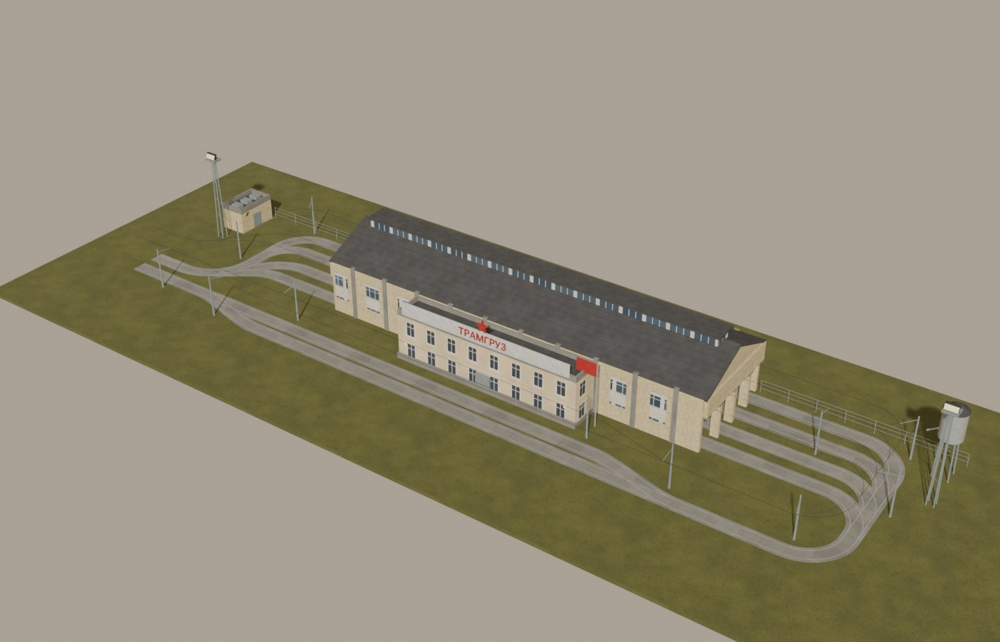
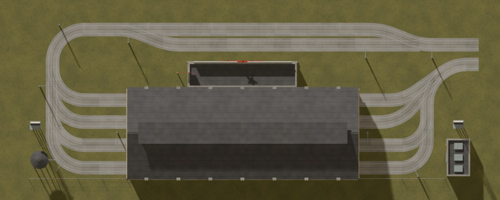

# Tram Distribution Office for Workers & Resources: Soviet Republic



*The trams will now run to plan.*

## COMRADE, THE TRAMS ARE STANDING IDLE!

Your republic has cargo trams. They are electric, they are punctual, they carry gravel, steel
and the municipal waste of a million citizens.

And yet every one of them waits in the depot for a comrade to **draw it a route by hand**, while
the trucks next door are dispatched by a distribution office like civilised vehicles.

**THE MINISTRY OF MUNICIPAL TRANSPORT HAS FOUND THIS SITUATION IDEOLOGICALLY UNACCEPTABLE.**

It therefore presents the **Tram Distribution Office**: the game's own distribution office,
taught to run cargo trams. It buys and keeps the trams, takes loading and unloading stations as
tasks, and sends a tram whenever a station has goods to move. No fixed routes, no idle trams.

> **Status: in service, under observation.** The office has dispatched open, covered,
> aggregate and waste trams through full load-unload-return cycles in the game. Fluid trams
> should behave like aggregate ones but have not been tried. The two yard buildings are new
> and still being checked in the game.

## WHAT THE MINISTRY PROVIDES

- **Two tram yards.**
  - *Tram Distribution Office (small trams)*: the game's small tram depot layout, four parking
    lanes, room for 24 vehicles. Takes cargo tram sets up to **30 m** (the small and medium sets).
  - *Tram Distribution Office (large trams)*: the same yard with lanes half as long again, room
    for 40 vehicles. Takes every cargo tram, including the long ones (35-41 m).

  Both have a brick tram shed with open portals, the two-storey ТРАМГРУЗ (*tram freight*)
  dispatch wing, a traction substation and a sand tower. Like the game's own depots, the yard's
  track and trolley wire are laid by the game itself along the layout, with proper curves.

  
- **The `tramdo` plugin**, which makes the office accept trams at all and keeps them moving:
  - only **cargo** trams may be bought or assigned (passenger trams stay with the tram depot),
    and the small yard turns away sets longer than its limit;
  - the office's own planning runs with fuel switched off, because trams are electric and the
    office would otherwise wait for ever to refuel them.

## HOW TO RUN IT

1. Install [Republic Mod Loader](https://steamcommunity.com/sharedfiles/filedetails/?id=3787969749)
   and some cargo trams, for example the
   [cargo tram collection](https://steamcommunity.com/workshop/filedetails/?id=3586298879) this
   office was built and tested with.
2. Install this mod (not on the Workshop yet: see *Build and install* below), enable it and its
   **tramdo** plugin in Republic Mod Loader, and launch.
3. Build an office on your tram network, buy cargo trams in its window (or move trams in), and give
   it tasks like any distribution office: the tram cargo stations to load at and to unload at.

### Good to know

- **Every wagon of a tram set takes one place in the office**, and the office lists the wagons
  beside their tram.
- Bulk goods (gravel, fluids) leave an unloading tram station by conveyor or pipe. **Run the
  conveyor straight into the storage**: with a conveyor *transfer* building in between, the office
  judges the transfer (always full) and keeps the trams at home. The yellow *unsupported with
  unloading* note on such stations is only a note and can be ignored.
- Station thresholds work as for trucks: a station set to dispatch at 20 % gets no tram before that.
- Without the plugin the offices take no trams at all.

## REQUIREMENTS

- Workers & Resources: Soviet Republic **1.1.1.9** (`SOVIET64.exe`). The plugin patches this exact
  build and refuses to hook anything it does not recognise.
- [Republic Mod Loader](https://steamcommunity.com/sharedfiles/filedetails/?id=3787969749).
- Cargo trams from a tram mod (the base game has passenger trams only).

## BUILD AND INSTALL

```powershell
.\build.ps1                 # compile the plugin into build\
.\build.ps1 -Install        # compile, then install the item into media_soviet\workshop_wip
```

Close the game and the loader first. Needs the MSVC x64 toolset (Visual Studio Build Tools,
*Desktop development with C++*) and a Windows 10/11 SDK; `build.ps1` finds them itself. The item
lands in `workshop_wip\9000310` with the plugin in its `plugins\` folder; enable both in Republic
Mod Loader's Development tab.

## REBUILDING THE CONTENT

```bash
python tools/build_tramdo.py              # textures, both yards, the item and poster, README images
python tools/build_tramdo.py yards item   # only some stages
```

- `tools/tramdo_layout.py` takes the yard layout from the game's own small tram depot
  (`tram_depo_small.ini`): tracks, trolley wires, parking lanes and station, stretched 1.5x
  lengthwise for the large yard.
- `tools/tramdo_scene.py` (Blender 5.x) models the buildings around that layout and writes the
  models, `building.ini` and previews.
- `tools/tramdo_workshop.py` writes `workshopconfig.ini`, the store page and the poster.

Needs Blender 5.x, Python 3 with Pillow and numpy; `capstone` for the reverse-engineering helpers.

## REPOSITORY LAYOUT

```
mod/plugins/tramdo/        the plugin (tramdo.cpp), tramdo.ini (settings), tramdo.rml.json, package.txt
mod/packages/tram_do/      the Workshop item: tramdo_small/, tramdo_large/, material/, workshopconfig.ini
tools/                     the generators (tramdo_*.py, build_tramdo.py), the shared kit (srkit, mmkit,
                           nmf, space_palette, space_textures, tradepost_textures, space_thumbs),
                           workshop_upload.py, rehelp.py / pe.py (reverse engineering)
tools/dev/                 in-game test helpers (memory probe, loader launch, window driver)
docs/images/               README and store page pictures
vendor/TesmioLoader/       the loader API headers the plugin builds against (GPL-3.0)
```

## BRANCHES

- `unstable`: day-to-day work, open.
- `dev`: pull requests from `unstable`, two approvals.
- `main`: pull requests from `dev`, approved by the code owner.

## REPORTING A STRANDED TRAM

Open an issue with what the office's window says (the task list and the vehicle's status), the
station setup (thresholds, what the conveyor connects to) and the `tramdo` lines of the loader log
(`rml/logs/rml-runtime.log` in Republic Mod Loader's folder). `log_decisions` in
`mod/plugins/tramdo/tramdo.ini` sets how many admit/refuse decisions the plugin logs.

## LICENCE AND CREDITS

GPL-3.0 (see `LICENSE`). The plugin builds against TesmioLoader by MaxLegend (GPL-3.0, headers in
`vendor/`) and runs on Republic Mod Loader by UltimateUniverse. The yard layout is the game's own
small tram depot's. The cargo trams come from other authors' mods; this office only runs them.

Workers & Resources: Soviet Republic is (c) 3Division. This is an independent fan-made mod, not
affiliated with or endorsed by 3Division or Hooded Horse.
